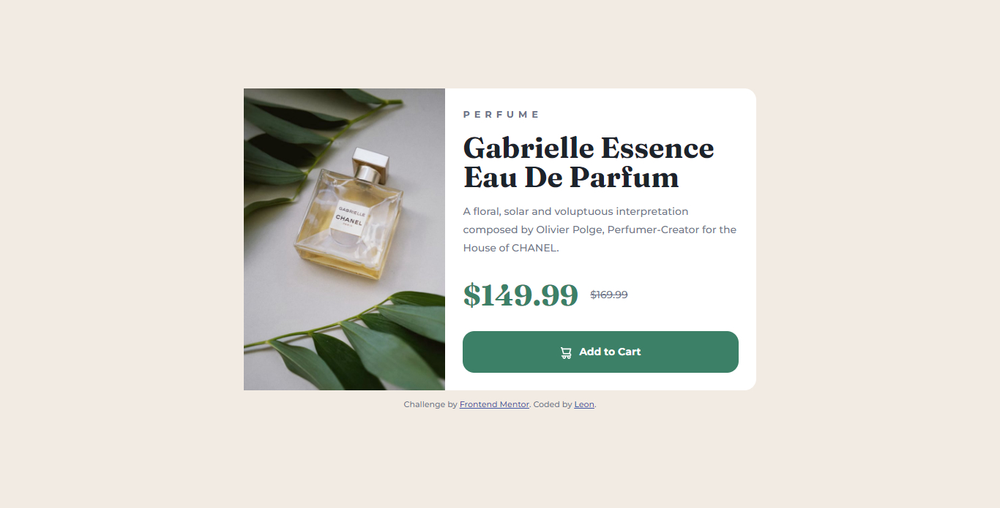

# Frontend Mentor - Product preview card component solution

This is a solution to the [Product preview card component challenge on Frontend Mentor](https://www.frontendmentor.io/challenges/product-preview-card-component-GO7UmttRfa).

## Table of contents

- [Overview](#overview)
  - [The challenge](#the-challenge)
  - [Screenshot](#screenshot)
  - [Links](#links)
- [My process](#my-process)
  - [Built with](#built-with)
  - [What I learned](#what-i-learned)
  - [Continued development](#continued-development)
  - [Useful resources](#useful-resources)
- [Author](#author)
- [Acknowledgments](#acknowledgments)

## Overview

### The challenge

Build a product preview card component and get it looking as close to the design as possible.

Users should be able to:

- View the optimal layout depending on their device's screen size
- See hover and focus states for interactive elements

### Screenshot

I've included screenshots for desktop and mobile in the `/screenshots` folder

### Links

- [Solution URL:](https://your-solution-url.com)
- [Live Site URL:](https://rupiacodes.github.io/product-preview-card-component/)

## My process

I wrote the HTML first. I then added the CSS using a mobile-first approach. I started by adding a CSS reset and the base styles. Afterward, I added the product card specific styles and then worked on making the component responsive on desktop.

### Built with

- Semantic HTML5 markup
- Flexbox
- CSS Grid
- Mobile-first workflow

### What I learned

- How to use the `<picture>` element and `srcset` attribute to swap images depending on the viewport size.
- How to use CSS `grid` to center align items.
- How to use the `::before` pseudo element to add content.

I also learned how to use a mobile-first workflow rather than the desktop-first approach I'm used to.

### Continued development

I reused certain styles several times throughout the project. I'll learn how to use CSS custom properties for future projects to speed up my workflow.

Overall, while the card wasn't pixel perfect, I think it turned out fairly well.

We continue building. Progress not perfection 💪🏿
